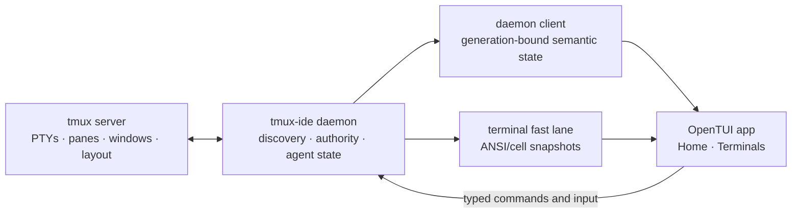

# tmux-ide architecture

tmux-ide 2.9 is an OpenTUI client for ordinary tmux sessions. tmux remains the
source of truth for processes, PTYs, windows, panes, layout, and persistence.
The app adds a visual shell, mouse and keyboard controls, agent awareness, and
safe terminal mirroring.

The current product surface is deliberately narrow:

- Home
- Terminals
- session, window, and pane controls
- agent discovery and status
- the minimal command palette

The web and native desktop clients are future consumers of the daemon contract;
they are not part of the 2.9 release cut.

## Runtime shape



The semantic path describes sessions, windows, panes, focus, and agent state.
The terminal fast lane carries terminal presentation without waking or rebuilding
the whole Solid application tree for every output burst.

## Ownership rules

### tmux owns terminal truth

tmux-ide never replaces tmux's PTY or multiplexer responsibilities. Closing the
visual client must not destroy a user's tmux session. Sessions remain attachable
with normal tmux tooling and work over SSH.

### The daemon owns authority

The daemon is the only boundary that mutates or observes live tmux state for the
application. Render components do not execute layout, selection, resize, or
lifecycle commands directly. The sole renderer-local tmux exception is host
clipboard policy in `host-local-tmux-adapter.ts`.

### One generation is active

Connections are prepared as candidates, then atomically promoted. A stale
generation cannot publish terminal state into the active workspace. Replacement
keeps the last coherent terminal presentation resident until its successor is
ready.

### One application input ingress

`application-root-v2.tsx` owns exactly one OpenTUI keyboard listener and one
paste listener. Components register semantic keyboard routes through
`ui/keyboard-router.tsx`; they do not create global stdin listeners. Pointer
handlers remain local to the component that owns the visible hit target.

### One semantic design system

All application chrome consumes semantic roles projected by `theme.ts`.
Components must not embed dark/light colors. Mirrored terminal cells are
application-owned output and keep the colors emitted by the program running in
the pane; switching the app theme does not recolor terminal applications.

## Production boot graph

The production OpenTUI path begins at:

1. `packages/daemon/src/tui/mirror/app.tsx`
2. `packages/daemon/src/tui/mirror/runtime/application-entry.ts`
3. `packages/daemon/src/tui/mirror/runtime/application-root-v2.tsx`

The root composes:

- `application-bootstrap.ts` for renderer startup
- `application-lifecycle.ts` for shutdown and cleanup
- `open-tui-generation-host.ts` for authority generations
- `terminal-fast-lane-renderer-adapter.ts` for terminal publications
- `pane-scoped-terminal-surface.tsx` for retained pane rendering
- `application-shell-view.tsx` for pure shell composition
- `ui/` for semantic primitives
- `workspace/` for pane and window presentation

`packages/daemon/test-support/opentui-production-root-manifest.ts` defines the
review roots and retired module boundaries. `production-data-path.test.ts`
walks the local import graph and rejects parallel authority stacks, raw chrome
colors, duplicate input listeners, and direct renderer-side tmux mutation.

## Repository packages

- `packages/contracts` — shared wire schemas and domain types
- `packages/core` — reusable application/domain logic
- `packages/daemon` — daemon, command center, tmux integration, and OpenTUI app
- `packages/daemon-client` — typed client for daemon resources and actions
- `packages/sdk` — public programmatic API
- `packages/tmux-bridge` — tmux protocol/process integration
- `apps/electron-shell` and `app/` — future desktop work, outside the 2.9 product cut
- `docs/` — marketing site and user documentation

## Public daemon boundary

The command center exposes a reusable protocol:

```text
GET /api/sessions
GET /api/project/:name
GET /api/project/:name/panes
GET /api/events
WS  /ws/mirror/:session/:paneId
```

A future web client should consume this boundary. It must not introduce a second
tmux authority or duplicate the OpenTUI runtime inside the website.

## Configuration

The app is configless by default and discovers existing sessions. An optional
`.tmux-ide/workspace.yml` describes a launch layout. `WorkspaceConfigV1` may
carry future-facing harness, agent, and mission data, but mission runtime wiring
is not a current surface. Legacy `team`, `role`, `task`, `sidebar`, and
`orchestrator` fields must not be reintroduced.

## Release invariants

Before publishing:

```bash
pnpm check
pnpm release:opentui:check
pnpm pack:check
pnpm test:pack-installed
```

The release is not ready when any of these are true:

- a fresh packed install cannot open a newly created local tmux session;
- terminal content vanishes during resize, reconnect, window switching, or idle;
- application chrome mixes semantic themes after a live theme change;
- more than one production keyboard or paste listener exists;
- a retired root, authority, adapter, or web-demo path is reachable or packaged;
- the docs claim a surface that the published product does not ship.

## Adding features

Keep new work behind the existing ownership boundaries:

1. define or extend a typed contract;
2. implement daemon authority and tests;
3. project state through the daemon client;
4. render with semantic UI primitives;
5. route keyboard behavior through the root keyboard owner;
6. add a packed-product or deterministic renderer journey;
7. update user docs only when the feature is in the release product.

Do not create a second application root, terminal replica, workspace authority,
or browser-only version of the TUI.
