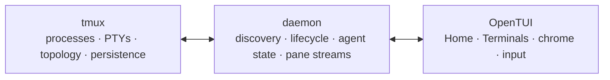

<p align="center">
  <picture>
    <source media="(prefers-color-scheme: dark)" srcset="https://raw.githubusercontent.com/wavyrai/tmux-ide/main/.github/assets/icon-dark.png" />
    
  </picture>
</p>

<h1 align="center">tmux-ide</h1>

<p align="center"><strong>A visual tmux client designed for working with coding agents.</strong></p>

<p align="center">
  
</p>

The demo above is a self-contained animated SVG generated from the production
OpenTUI renderer—not a video or a hand-maintained mockup. It is committed with
the project, so the animation runs directly in GitHub.

tmux-ide adds an application shell to ordinary tmux sessions. tmux still owns
the processes, PTYs, sessions, windows, panes, and persistence; tmux-ide adds
Home, clickable pane and window chrome, agent indicators, memorable names, and
direct controls. Close the app and the underlying sessions keep running.

## Install the OpenTUI beta

```bash
npm install -g tmux-ide@beta
tmux-ide app
```

Open a particular session directly:

```bash
tmux-ide app work
```

The first app launch downloads the exact-version OpenTUI runtime for macOS or
Linux, verifies its release metadata and SHA-256 digests, and caches it under
`~/.tmux-ide/bin`. Installed users do not need Bun.

To reset a running daemon's runtime while keeping its supervising process and
tmux sessions:

```bash
tmux-ide daemon restart --json
```

The command verifies a new daemon generation under the same process, preserving
the active listener and remote-access settings. It does not start a missing
daemon or load newly installed code; use `tmux-ide update --daemon` for the
separate version-upgrade flow. The existing `tmux-ide restart` command still
restarts an IDE session.

## What ships in 2.9

- **Home and Terminals** over live tmux sessions, with no project config
  required.
- **Agent indicators** in the sidebar, window tabs, and pane chrome.
- **Keyboard and mouse control** for session, window, and pane selection;
  splitting, resizing, renaming, creating, and confirmed closing.
- **Truecolor terminal mirroring** with retained content through quiet periods,
  resizing, theme changes, daemon replacement, and reattachment.
- **SSH compatibility** because the source of truth remains ordinary tmux.
- **A future-proof daemon boundary** that a later web client can reuse. The web
  client is intentionally not part of this release.

Useful controls:

| Control      | Action                                |
| ------------ | ------------------------------------- |
| `F1`         | Home                                  |
| `F2`         | Terminals                             |
| `F5`         | Commands                              |
| `Ctrl+O`     | Next pane                             |
| `Ctrl+T`     | Next window                           |
| `Meta+Arrow` | Resize focused pane                   |
| `Ctrl+Q`     | Quit, or put away a detachable viewer |

## Optional workspace layout

tmux-ide works without configuration. To describe a reproducible project
layout, scaffold `.tmux-ide/workspace.yml`:

```bash
tmux-ide init
tmux-ide start
```

```yaml
version: 1
name: my-app

terminal:
  rows:
    - size: 70%
      panes:
        - title: Claude
          command: claude
          focus: true
        - title: Shell
    - panes:
        - title: Dev server
          command: pnpm dev
```

Legacy `ide.yml` files still load through a compatibility adapter. Use
`tmux-ide migrate --dry-run` before writing the current format.

## Architecture



This separation is deliberate: tmux has years of terminal, resize, disconnect,
shell, and SSH edge-case coverage. tmux-ide does not replace that foundation or
put your work behind a proprietary session format.

## Requirements

- tmux 3.0 or newer; 3.2+ recommended
- Node.js 20 or newer
- macOS arm64/x64 or Linux arm64/x64 for the downloadable OpenTUI runtime
- Bun only when developing or compiling the TUI from a checkout

Run `tmux-ide doctor --json` for an environment report.

## Development

```bash
pnpm install --frozen-lockfile
pnpm release:opentui:check
pnpm docs:build
```

The focused OpenTUI release gate builds and checks the package, runs renderer
and lifecycle tests, and installs the packed tarball into an isolated new-user
environment.

Regenerate the production-renderer demo with `pnpm demo:tui`.

- [Documentation](https://github.com/wavyrai/tmux-ide/tree/main/docs)
- [Contributing](CONTRIBUTING.md)
- [Release checklist](RELEASE.md)
- [Changelog](CHANGELOG.md)
- [Security](SECURITY.md)

## License

[MIT](LICENSE)

Owner-authorized `GET /api/resources/workspace-admission` returns a versioned,
passive snapshot of workspace promotion and workspace-open admission. Each
backend reports `pending`, its `limit`, `disposed`, and retained receipt counts
(`retained` / `retentionLimit`). A `null` backend means unavailable or unknown.
`pending >= limit` indicates queue pressure; `disposed` refuses new work.
Promotion replay retention does not block admission. For workspace-open,
`retentionMayBlock` indicates the current legacy receipt ledger is full; normal
admission may still retire closed-workspace receipts and proceed. The snapshot
performs no inventory discovery, mutation, or reservation. It describes only
these admission owners, not whole-daemon readiness; `/health` remains liveness.

`tmux-ide update --dry-run --json` reports the planned update without installing
packages or refreshing skills. Stable installations use the npm `latest` tag;
prerelease installations use `beta`. Update checks and notification receipts are
cached separately per channel. The updater resolves its own installation path
and verifies that the active npm, pnpm, or Bun global destination matches it
before executing an argument-based manager command. Homebrew, Yarn, npx, source
checkouts, unknown layouts, and mismatched manager prefixes receive manual
instructions. Package postinstall owns skill refresh; `tmux-ide skill-sync` is
available explicitly for installations that skip lifecycle scripts.

Node.js 20 or newer is required. `doctor` accepts a project without a workspace
preset; a present but malformed `.tmux-ide/workspace.yml` still fails validation.
