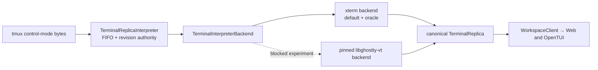

# ADR 0003: Canonical terminal interpreter backends

Status: accepted seam; native implementation blocked on upstream capabilities.

## Decision

`TerminalReplicaInterpreter` remains the only owner of FIFO ordering, daemon generation and
incarnation fences, revisions, hashes, patches, raw commits, and delivery. A parser backend owns
only terminal parsing and projection:

The default is the immutable `@tmux-ide/xterm-headless@6.0.0-tmuxide.2` release asset. It is a
source-reviewed fork of xterm.js `6.0.0` that exposes one public proposed API,
`Terminal.prioritizeNextWrite()`. The exact release asset, SHA-256 and SRI digests, upstream and
fork commits, annotated tag object, SBOM digest, and producing workflow run are pinned in
`packages/daemon/src/terminal/session-runtime/xterm-headless-provenance.json`. The daemon consumes
that public API through `TerminalInterpreterBackend`; the scheduling integration does not patch
minified output or invent a private scheduling hook. The existing projection adapter still
fail-closes on its pinned xterm buffer shape, and the fork does not expand that dependency. Backend
injection exists for differential tests; it is not a second protocol, reducer, runtime authority,
or UI-specific state model.

Priority is a one-shot scheduling hint only. After a control write is successfully admitted, the
replica owner arms the interpreter, and the interpreter delegates immediately before the next
actual stream or reseed write. Admission failures do not arm it, repeated requests still cover
only one write, backend replacement preserves the hint for the replacement, and synthetic
DEC-synchronized-output recovery does not consume it. The hint changes neither terminal semantics
nor controller, generation, incarnation, revision, hash, delivery, or UI authority.

## Native pin evaluated

The native candidate is the Node-API binding `@coder/libghostty-vt-node@0.1.0-beta.1` at binding
commit `08607e8029e0e30c7975018e64156b9b34d7f450`. It statically pins official Ghostty commit
`48ccec182a932c2ec04c344d45a5fc553861cb13`, Zig 0.15.2, `ReleaseFast`, and SIMD disabled.
The addon belongs in the Node daemon, not the Bun/OpenTUI binary, so Web and TUI consume the same
canonical replica.

The binding is not added as a dependency yet. Its published API cannot faithfully represent the
current canonical contract. The machine-readable capability record is
`packages/daemon/native/ghostty-vt-backend.json`.

## Blocking fidelity gaps

The evaluated binding lacks dense spacer cells, wrapped-row state, default/indexed/RGB source
color identity, five canonical attributes, rich underline state, full cursor state, terminal
modes, styled scrollback, dirty-row deltas, and hyperlink/Kitty placement data. Converting its
sparse snapshot today would silently corrupt terminal truth and can make a fast benchmark look
green by doing less work.

The official libghostty-vt C API can expose most of these concepts, but is explicitly unstable.
The preferred route is an upstream extension of the existing Node-API binding with a packed,
canonical-capable snapshot/delta API. tmux-ide does not implement another terminal emulator or add
private xterm scheduling APIs. The narrow xterm scheduling fork described above is an immutable,
reviewed public-API delta and is not a terminal-semantics fork.

## Fail-closed rollout

Native selection stays explicit and experimental. Loading must verify the exact Ghostty commit
and capability version. Missing binaries, a pin mismatch, unsupported platforms, projection
validation failures, or differential mismatches select xterm before a pane runtime is admitted.
There is no mid-generation backend switch.

Promotion requires all capability flags in the manifest, hash-identical snapshots and patch
ordering across the conformance corpus, exact mode/cursor/history/style coverage, clean 30-cycle
retirement, packaged-install coverage for every advertised platform, and materially better
ProductRig measurements without changing budgets.

`@xterm/headless-stock@npm:@xterm/headless@6.0.0` remains test-only as the semantic differential
oracle and rollback reference. Every conformance chunk plus deterministic UTF-8 split, resize,
alternate-screen, history, and DEC-sync sequences must remain snapshot-identical after each
acknowledged chunk. ProductRig is the acceptance gate for the scheduling improvement; its product
deadline and semantic, authority, and delivery assertions are unchanged.

## Artifact and supply-chain policy

If the upstream API becomes sufficient, exact platform packages are preferred over a fat npm
tarball. Builds use immutable source archives and checksums, the pinned Zig toolchain, recorded
SDK/glibc targets, SBOMs and third-party notices, SHA-256 manifests, GitHub attestations, and npm
trusted publishing provenance. macOS app artifacts are signed and the final app is notarized.
Windows native support is not claimed while tmux itself is supported through WSL.
