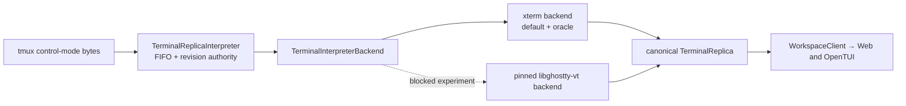

# ADR 0003: Canonical terminal interpreter backends

Status: accepted seam; native implementation blocked on upstream capabilities.

## Decision

`TerminalReplicaInterpreter` remains the only owner of FIFO ordering, daemon generation and
incarnation fences, revisions, hashes, patches, raw commits, and delivery. A parser backend owns
only terminal parsing and projection:

The default is the pinned xterm adapter. Backend injection exists for differential tests; it is
not a second protocol, reducer, runtime authority, or UI-specific state model.

## Native pin evaluated

The native candidate is the Node-API binding `@coder/libghostty-vt-node@0.1.0-beta.1` at binding
commit `08607e8029e0e30c7975018e64156b9b34d7f450`. It statically pins official Ghostty commit
`48ccec182a932c2ec04c344d45a5fc553861cb13`, Zig 0.15.2, `ReleaseFast`, and SIMD disabled.
The addon belongs in the Node daemon, not the Bun/OpenTUI binary, so Web and TUI consume the same
canonical replica.

The binding is not added as a dependency yet. Its published API cannot faithfully represent the
current canonical contract. The machine-readable capability record is
`packages/daemon/native/ghostty-vt-backend.json`.

## Blocking fidelity gaps

The evaluated binding lacks dense spacer cells, wrapped-row state, default/indexed/RGB source
color identity, five canonical attributes, rich underline state, full cursor state, terminal
modes, styled scrollback, dirty-row deltas, and hyperlink/Kitty placement data. Converting its
sparse snapshot today would silently corrupt terminal truth and can make a fast benchmark look
green by doing less work.

The official libghostty-vt C API can expose most of these concepts, but is explicitly unstable.
The preferred route is an upstream extension of the existing Node-API binding with a packed,
canonical-capable snapshot/delta API. tmux-ide does not implement another terminal emulator or
fork private xterm APIs.

## Fail-closed rollout

Native selection stays explicit and experimental. Loading must verify the exact Ghostty commit
and capability version. Missing binaries, a pin mismatch, unsupported platforms, projection
validation failures, or differential mismatches select xterm before a pane runtime is admitted.
There is no mid-generation backend switch.

Promotion requires all capability flags in the manifest, hash-identical snapshots and patch
ordering across the conformance corpus, exact mode/cursor/history/style coverage, clean 30-cycle
retirement, packaged-install coverage for every advertised platform, and materially better
ProductRig measurements without changing budgets.

## Artifact and supply-chain policy

If the upstream API becomes sufficient, exact platform packages are preferred over a fat npm
tarball. Builds use immutable source archives and checksums, the pinned Zig toolchain, recorded
SDK/glibc targets, SBOMs and third-party notices, SHA-256 manifests, GitHub attestations, and npm
trusted publishing provenance. macOS app artifacts are signed and the final app is notarized.
Windows native support is not claimed while tmux itself is supported through WSL.
