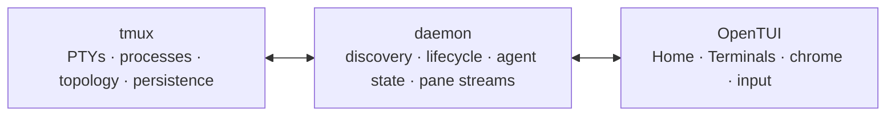

tmux-ide is a mouse-friendly OpenTUI application around ordinary tmux sessions.
It adds Home, clickable window and pane chrome, agent indicators, memorable
names, and direct controls. tmux remains the authority for processes, PTYs,
topology, persistence, and SSH.

```bash
npm install -g tmux-ide@beta
tmux-ide app
```

## The current app

The default app starts with two core views and adds project-defined views when
they are present in `.tmux-ide/workspace.yml`:

- **Home** discovers live sessions and provides a clean first-run state.
- **Terminals** renders the selected tmux session with window tabs, pane
  headers, agent awareness, and terminal content.
- Optional **Files**, **Diff**, and **Missions** panels can appear through
  `app.views`; mission profiles are validated but not dispatched by the CLI yet.
- **Commands** exposes contextual actions and settings.
- Mouse and keyboard control pane focus, windows, splitting, resizing,
  renaming, creation, and confirmed closing.
- `tmux-ide web` is intentionally unavailable in this beta; the canonical
  daemon API remains renderer-neutral.

## Why tmux stays underneath

tmux has years of coverage for shells, terminal modes, resizes, detach/attach,
disconnects, and SSH. tmux-ide does not duplicate that multiplexer. If the app
or daemon stops, your sessions remain ordinary tmux sessions.



Continue with [Getting started](/docs/getting-started) or read the
[2.9 release cut](/docs/release-2-9-0-beta-1). The
[OpenTUI demo](/docs/demo) is generated from the production component tree.
