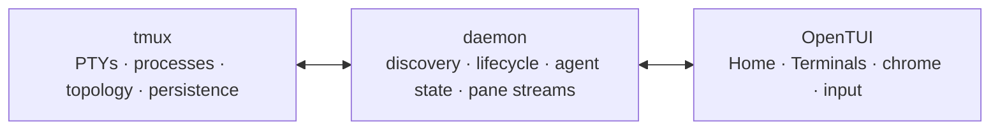

# tmux-ide

tmux-ide is a mouse-friendly OpenTUI application around ordinary tmux sessions.
It adds Home, clickable window and pane chrome, agent indicators, memorable
names, and direct controls. tmux remains the authority for processes, PTYs,
topology, persistence, and SSH.

```bash
npm install -g tmux-ide@beta
tmux-ide app
```

## The product boundary

The 2.9 release is deliberately narrow:

- **F1 Home** discovers live sessions and provides a clean first-run state.
- **F2 Terminals** renders the selected tmux session with window tabs, pane
  headers, sidebar agents, and terminal content.
- **F5 Commands** exposes the actions appropriate to the current state.
- Mouse and keyboard control pane focus, windows, splitting, resizing,
  renaming, creation, and confirmed closing.
- A later web client can use the same daemon API, but the web client is not part
  of this release.

## Why tmux stays underneath

tmux has years of coverage for shells, terminal modes, resizes, detach/attach,
disconnects, and SSH. tmux-ide does not duplicate that multiplexer. If the app
or daemon stops, your sessions remain ordinary tmux sessions.



Continue with [Getting started](/docs/getting-started) or read the
[2.9 release cut](/docs/release-2-9-0-beta-1). The
[OpenTUI demo](/docs/demo) is generated from the production component tree.
