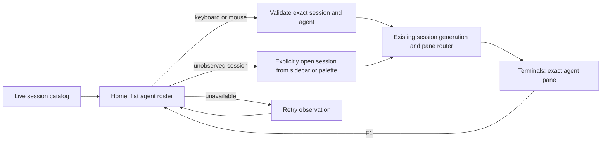
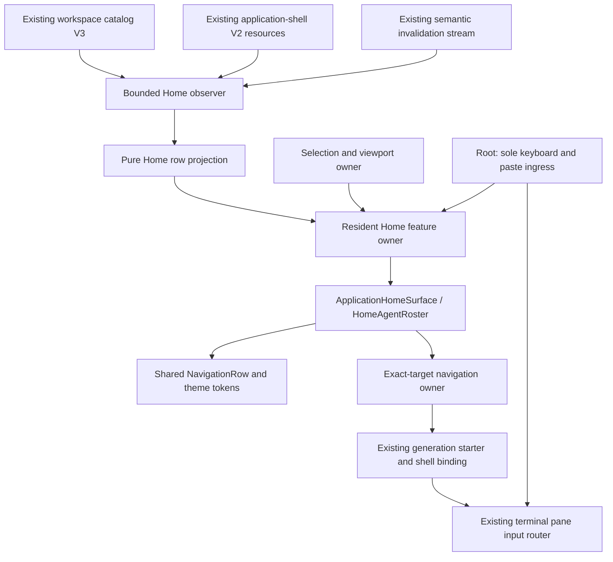

# Agent Home design system increment

This completes the bounded P1–P5 agent-Home mission on `codex/agent-home-polish`,
based on 2.9.0-beta.7 (`e80e579e`), after the shared-chrome polish in `b758c4b1`.
It is an integration candidate, not an npm release or a claim of full Gloomberb parity.

## User flow

Home puts attention-first agent rows above actions, with stable identity, session
context, honest observed-session counts, and explicit loading, empty, refreshing,
unavailable and truncated states. A row is a navigation intent, not another agent
runtime. Returning Home preserves selection and scroll where the target still exists.

## Composition and ownership

- `application-home-agents.ts`: pure semantic-to-row projection and deterministic ordering.
- `application-home-agent-observer.ts`: bounded read lifecycle, invalidation, cancellation,
  retries and stale-response protection. It does not spawn agents or promote sessions.
- `application-home-agent-transport.ts`: existing HTTP/WebSocket transport adaptation;
  no terminal subscriptions, polling loop or new daemon endpoint.
- `application-home-agent-selection.ts`: resident selection and viewport state.
- `application-home-agent-navigation.ts`: exact daemon/session-incarnation/agent/pane
  admission and cancellation through the existing generation path.
- `application-home-agents-owner.ts`: Solid composition and cleanup, including competing
  palette/chrome navigation. Leaves receive typed state and callbacks, not service clients.
- `application-home-agent-roster.tsx`: presentation using shared row and theme contracts.

All source modules above are under `packages/daemon/src/tui/mirror/runtime/`.
The root retains the only physical keyboard/paste handlers. No leaf gains a second
keyboard dispatcher, tmux client, generation authority or terminal input router.

### Worked component contract

`HomeAgentRoster` receives a snapshot, a selected identity/viewport and intent
callbacks. Hover highlights without opening. Keyboard activation and mouse activation
share the same target callback; source provenance is preserved by session/surface
navigation. The existing pane router remains source-neutral.

The isolated `application-home-agent-roster-renderer.test.tsx` tests layout and row
interaction. `application-home-agent-flow-renderer.test.tsx` composes the Home surface,
selection and exact-target navigation intents with the terminal view. Owner/navigation unit
tests separately cover asynchronous admission, stale incarnations and cancellation.
All renderer suites, including catalog-session sidebar recovery, are registered in
both the normal renderer gate and the OpenTUI release gate.

## Existing runtime limits, made visible

The catalog can list an ordinary tmux session before the daemon has registered an
application-shell resource for it. That resource returns 404 until the user opens
the session. Home therefore says how many sessions it has observed and offers an
explicit recovery through the existing Terminals sidebar/command palette. It does
not silently promote sessions or imply that an unavailable session has no agents.

Observation starts with 32 sessions and supports explicit incremental loading.
At most two reads are logically outstanding; semantic invalidations are batched
within protocol subscription limits. Background Home observation stops when inactive.
Rows retained during refresh/failure are not actionable until their target is current.

No invented token usage, costs, progress percentages, history or task descriptions.
No onboarding, theme persistence migration, floating/docking system, new agent-detail
screen, or backend registry redesign belongs to this increment. Those remain separate
future missions requiring their own product and runtime contracts.

## Visual and design-document contract

The approved layout is the **flat roster**, not grouped project cards. It reuses
the current typography, semantic theme tokens, compact Home wordmark, navigation
rows and pane chrome. The terminal host chooses the actual font; Berkeley Mono in
Prototyper is a design-preview preference, not a terminal font override or bundled font.

In the tmux-ide Prototyper workspace, update only these source-matched documents:

| Document                       | Source/state coverage                                 |
| ------------------------------ | ----------------------------------------------------- |
| `current-04-home`              | Populated agent Home, dark/light                      |
| `current-05-home-empty`        | Empty, loading and unavailable observations           |
| `current-07-application-shell` | Wide, refreshing, disappearance and Unicode states    |
| `current-10-terminal-chrome`   | Exact retained terminal framebuffer and shared chrome |

The index distinguishes this revision from historical/unaffected artboards. These
are DC **documents**, not presentations. Captured terminal cells come from the actual
OpenTUI renderer; fixtures are labelled, not claimed as live production data.

## Simplification achieved

This increment composes existing rows, theme tokens, generation binding and terminal
input infrastructure instead of duplicating them. Observation, presentation and
navigation have independent testable owners with lifecycle cleanup. The docs marketing
wordmark generator no longer scrapes a private TUI logo constant, so changing the Home
wordmark cannot break the documentation build.

The Home mission does not justify unrelated worktree deletion, broad legacy removal
or adopting Gloomberb's full window manager. Integration and release remain explicit
decisions after the verification receipt.
