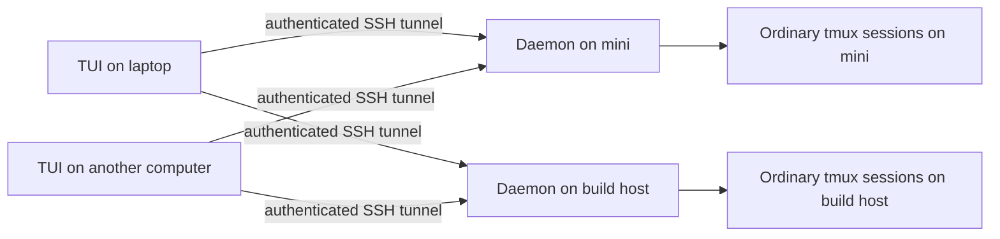
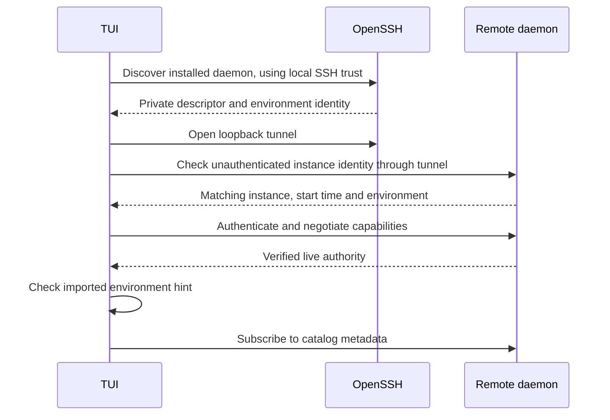
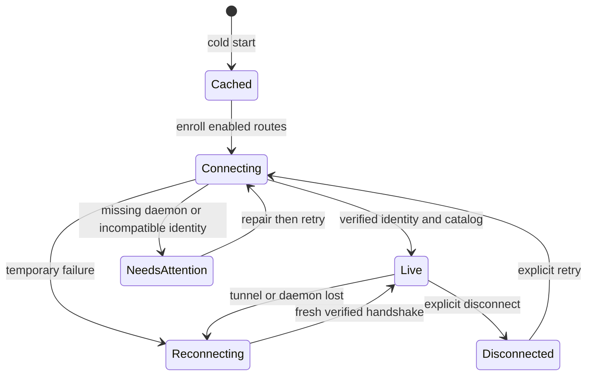
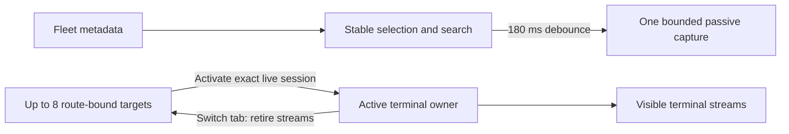

# Distributed daemons and one TUI

Implementation cards and the architecture plan live on [Sfora](https://www.sfora.ai/org/wavyr/notes/mx72n2ekkdz9xaz218v94k9xe58e5fpe). Fleet enrollment and tabs arrived in beta 16. Beta 18 unifies F5/F6 navigation and previews with responsive layouts and bounded preview memory.

Each computer owns its daemon and ordinary tmux sessions. Any enrolled computer can run a TUI and connect directly to every reachable host. The computer that first configured the directory can be offline. SSH configuration, host trust, and authentication remain local to each computer.



## Enroll and move a directory

Start the installed local daemon, preview adding an SSH alias, then write it:

```sh
tmux-ide update --daemon --json
tmux-ide machines add mini --json
tmux-ide machines add mini --write --json
tmux-ide machines export --json > fleet.json
```

Copy `fleet.json` to another computer. Edit each `sshTarget` to match that computer's SSH configuration. Then run:

```sh
tmux-ide update --daemon --json
tmux-ide machines import fleet.json --json
tmux-ide machines import fleet.json --write --json
tmux-ide
```

The directory contains route IDs, labels, aliases, enabled flags and optional environment identity hints. It contains no credentials. Import is add-only: conflicting existing routes cause the whole write to fail. SSH access is required independently; an imported directory grants none. Imported environment hints are checked against authenticated discovery before any catalog becomes live.

If a remote daemon is missing, explicitly start the installed version:

```sh
tmux-ide machines start mini --json
tmux-ide machines start mini --write --json
```

This runs the installed remote `tmux-ide update --daemon` and verifies a fresh handshake. It does not install a package. Package installation or upgrade is a separate operator action. Closing a TUI closes its SSH transports, leaving remote daemons and tmux sessions running.



## TUI behavior

| Control                           | Action                                                  |
| --------------------------------- | ------------------------------------------------------- |
| F5                                | Search commands and all machines, with window previews  |
| Ctrl+Space in F5/F6               | Toggle search / normal navigation mode                  |
| Ctrl+Left / Ctrl+Right in F5/F6   | Preview previous / next window without activating it    |
| Ctrl+P / Ctrl+E in F5/F6          | Hide/show / expand/restore preview                      |
| j/k, g/G, Ctrl+U/D in normal mode | Move, first/last, half-page                             |
| ? in normal mode or sidebar       | Show keyboard help                                      |
| PageUp / PageDown                 | Move through command results or sidebar                 |
| Ctrl+G                            | Focus the machine sidebar                               |
| F6                                | Search machines, sessions and agents across the fleet   |
| F7                                | Open the live attention inbox                           |
| F9 / Shift+F9                     | Next / previous retained session tab                    |
| Ctrl+F9                           | Close tab (leaves the tmux session running)             |
| F8 / Shift+F8                     | Previous / next available session in navigation history |
| F in sidebar / Ctrl+F in switcher | Toggle session favorite                                 |
| R / D in sidebar                  | Retry / disconnect the focused remote route             |

Search includes host labels. Session selection follows stable live IDs across renames. Agent activation uses the current exact agent target. Browsing and previews never own terminal input or resize. F5 also offers explicit create and confirmed close actions on the selected host; these use the authenticated owner action lane, with daemon and session-incarnation checks. Cached sessions remain visibly unavailable until live discovery confirms them.

Catalog metadata, favorites, collapsed groups and recents are bounded and stored by the local daemon in `fleet-view.json`. No terminal output or credentials are cached. Files use private atomic writes. If the local daemon is unavailable, preferences stay in memory and retry saving; invalid existing files are preserved.



Four concurrent handshake slots bound large fleets; selecting a queued machine raises its priority. Retry delay uses jitter and a thirty-second cap. Multiple verified routes to one environment share a display group. Selecting a route remains explicit: display deduplication never silently changes mutation authority.

Up to eight session tabs retain their explicit SSH route and live session identity. F9 switches between hosts without searching again. Only the active tab owns terminal streams; suspended tabs retain targets only. Closing a tab leaves its tmux session running. Reopening an unavailable or replaced session never silently selects a different route or a new session with the same name.

F5 and F6 share the same preview component and request owner. After selection settles for 180 ms, previews refresh one second after each completed capture while visible; errors back off to two, four and eight seconds. Hiding or closing the preview, opening F6 over it, or losing renderer focus cancels requests. Ctrl+Left/Right browses window snapshots without selecting the remote tmux window. Window, session and collapsed-host activity uses existing agent metadata; unknown/offline state is explicit. Metadata refreshes do not repeat that capture. The daemon permits one capture at a time, spaces requests by at least 250 ms and cancels captures after 1.5 seconds. Snapshots contain at most 24 lines and 8,192 characters of text, are never persisted, and never attach, resize or send terminal input. Small terminals omit the preview. Older daemons display an unavailable preview while navigation remains usable.



Nearby discovery remains deferred. Enrollment uses explicit SSH aliases and the verified handshake above.

## Qualification

Run `pnpm check` for the repository release gate. To opt into read-only SSH qualification against an existing daemon:

```sh
TMUX_IDE_FLEET_TEST_SSH=mini pnpm --filter @tmux-ide/daemon exec vitest run src/tui/mirror/runtime/application-fleet-live-ssh.test.ts
```

The test opens three transports in two independent clients, verifies route deduplication, disposes one client and checks the other remains live. It does not send terminal input or manage remote processes. Real WAN impairment, visual two-computer interaction and browser/TUI resize ownership still require the broader product qualification recorded in F09.

For a reproducible local preview responsiveness check, build the CLI and run `node scripts/fleet-preview-performance.mjs`. It creates and removes a private tmux server and daemon, checks synthetic output, and reports preview and concurrent identity request p95 latency. It never reads ordinary session output. One local 12-sample run measured 31.3 ms preview p95 and 2.5 ms concurrent identity p95; these are observations, not WAN guarantees.

## Beta 17 readiness and actions

F5 includes machine rows even for empty hosts. Select one and choose **New on host**. On a session row, **Close session** shows the exact host/session and requires typing `yes`. Switching the highlighted target cancels confirmation. The daemon verifies the live session again inside the mutation lane and addresses its runtime identity, so a stale confirmation cannot close a replacement with the same name. Creating and closing does not require attaching a TUI to that session.

Initial terminal negotiation and seed delivery prioritize visible panes. Ready visible windows can activate while hidden panes finish; unseeded/reseeding panes reject input. Deferred geometry coalesces to the latest dimensions, and missing hidden seeds trigger repair. A missing visible pane still blocks that window intentionally. These changes address the hidden-pane readiness barrier; they are not a guarantee of instantaneous activation over every network.

Run `node scripts/fleet-session-actions-smoke.mjs` after `pnpm build:cli` for an isolated real HTTP create/close/replacement test. It owns a private tmux server and state directory and cleans both up. The installed-package journey includes warm F5 switching measurements alongside startup and recovery evidence.

## Beta 18 command center

F5, F6 and the F7 attention filter use the same responsive command surface. Wide terminals show results beside the preview; narrower terminals stack them. Expand hides the list entirely. The component library owns dialogs, rows, buttons, badges, key hints, themes and pointer behavior. Very small terminals prioritize results over extra chrome.

Search uses the existing shared fuzzy matcher, now optimized with a suffix scan while preserving scores and tie-breaking. Matching letters are highlighted as runs. Favorites and recently visited sessions break equal-score ties, and the selected identity survives catalog reorder. Ctrl+H toggles local-only/all-host results. Page keys use the actual visible list height; Ctrl+U/D in normal mode moves half that height.

Ctrl+N creates on the highlighted host, Ctrl+X opens exact-session close confirmation, and Ctrl+F toggles session favorites. If a search has no results after a host was selected, Ctrl+N prefills that search as a name; the dialog explicitly identifies the host before submission. Ctrl+R retries the selected host.

Preview revisits immediately show a recent memory snapshot marked refreshing. At most 24 snapshots are retained, expire after 30 seconds, and are keyed by route, daemon incarnation, connection epoch and selected window. Nothing is written to disk, and stale content never grants input authority. The selected preview window is remembered in a bounded memory map. Dialogs pause preview work.

The daemon runs independent metadata reads in at most two concurrent lanes, under the existing capture deadline and incarnation checks. F6 no longer builds a duplicate fleet catalog. The UI computes search highlights once per visible row instead of once per character.

Connection feedback names the host and session and offers Choose another session directly. Existing sidebar navigation remains available. Retaining terminal renderers across session tabs is not enabled: the switcher cache is passive text, not an input-ready terminal. Background terminal streams and custom host color overrides remain separate work.
