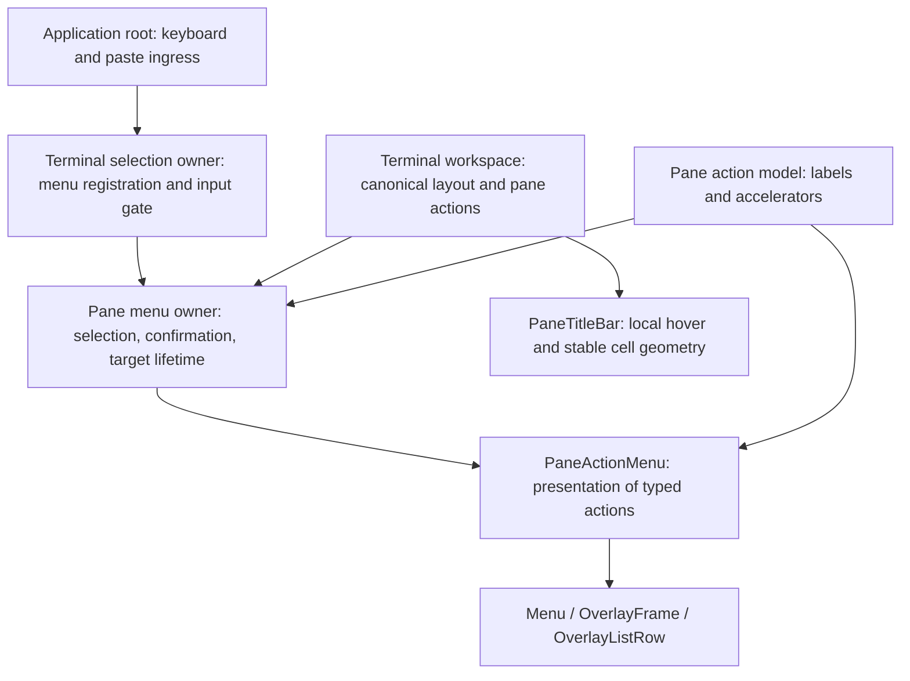

# Pane workspace polish — first increment

This follows the integrated agent Home redesign. It is an implementation on
`codex/pane-workspace-polish`, based on main `3efe3de1`, not a new beta release.
The scope is pane headers, pane menus, and focus/hover/input behavior. Searchable
commands, settings/themes, onboarding, and the remaining tool screens are later
increments, not completed by this patch.

## Interaction contract

- A pane header always occupies one row. Its title, status, and three-cell action
  slot keep their geometry when hover, focus, availability, or menu state changes.
  Tiny widths omit the action slot; status is omitted before it crowds out the
  title. When shown, status words such as `working` and `blocked` are not
  needlessly truncated.
- Active titles are emphasized. Hover brightens an inactive header without
  selecting its pane. Actions are visible on selection, focus, hover, or while
  their menu is open. Agent attention remains independent from selection.
- Overflow, right click, and **Shift+F10** on the focused pane open the same menu.
  Ordinary F10 is not intercepted. The existing root keyboard ingress dispatches
  the shortcut; components do not register another physical input listener.
- Menu rows have a fixed selection gutter and right-aligned accelerators. Moving
  the pointer highlights a row; arrow keys resume from that row. A stationary
  pointer does not overwrite keyboard selection after a render.
- Enter activates the selected row; R renames, Right splits right, D splits down,
  and X begins close confirmation. Enter is a selection action, not a permanent
  shortcut for “Select text”.
- Closing requires two deliberate activations. Leaving the close row disarms it;
  reported repeat/release events and Ctrl/Alt-modified keys cannot confirm it.
  Escape or an outside click dismisses the menu without activating underlying
  terminal content.
- An open menu blocks all other keyboard input, paste, and terminal pointer
  forwarding. When dismissed, the existing pane selection remains in place; no
  terminal remount or synthetic focus restoration is needed.
- Menus retire when their pane leaves the visible layout, the renderer epoch
  changes, or a higher-level palette/rename overlay takes input ownership. They
  must not reappear when that overlay closes.

## Composition and ownership

`application-pane-menu-owner.ts` owns only local overlay state. It does not own
daemon lifecycle or introduce a new backend. `pane-action-menu-model.ts` is the
single pane-menu vocabulary shared by rendering and accelerator dispatch.

Menus and rows retain their renderable identity while selection or confirmation
changes. `ApplicationTerminalWorkspace` keeps its existing retained terminal
surfaces, selection leases, resize previews, and semantic action callbacks.
`PaneTitleBar` owns pointer hover locally and emits intents; it cannot execute
tmux commands. All colors use the existing semantic theme roles.

The fixed row gutter is opt-in for `Menu`; the compact command palette keeps its
existing narrow-width budget until its own design increment. No second component
framework, global keymap, floating/docking system, or PTY recoloring is added.

## Evidence and design mirror

Renderer regressions cover dark/light states, real pointer transitions, keyboard
opening, stable menu row identity, exact action IDs, disabled actions, tiny and
Unicode headers, confirmation, overlay supersession, and pane disappearance.
Owner tests cover key modifiers, repeat events, input-gate registration/cleanup,
and generation invalidation. Existing workspace regressions continue to cover
terminal retention, resizing, application mouse forwarding, and text selection.

The Prototyper workspace document **current-10-terminal-chrome** shows six
source-rendered states of the actual `ApplicationTerminalWorkspace`, with
deterministic terminal content in dark and light themes. These are fixtures, not
recordings of live agents. The document records a source digest and uses Berkeley
Mono for browser review; users still choose their real terminal font.

Verification for this increment:

- `pnpm test:tui-renderer`: 240 tests, 74 snapshots passed.
- Focused ownership, entry/input, and architecture checks: 45 tests passed.
- `pnpm lint`, daemon typechecks, changed-file formatting, `git diff --check`,
  `pnpm build:cli`, and `pnpm build:tui` passed. The root remains 503 lines.
- The compiled TUI was exercised against a disposable two-pane tmux session on
  isolated target/host sockets at 120×40 and 80×24. Shift+F10 opened the focused
  pane menu. Pasted text and unknown keys did not reach the shell while open.
  Escape restored normal shell input. Close confirmation was armed and cancelled;
  rename opened and cancelled without changing the pane. The fixture processes
  were stopped afterward; user sessions were not used.
- Six browser previews were verified against the renderer's exact decoded text
  and cell widths, with Berkeley Mono loaded. Prototyper HTML and capture data
  were read back after publication. Local evidence is retained under
  `/tmp/tmux-ide-pane-polish.pg3RDg/`.

This is not a full release qualification or a claim about every terminal/SSH
combination. Other terminal-specific Shift+F10 encodings and pointer reporting
still warrant manual testing before release. No release claim is made by this
increment.
