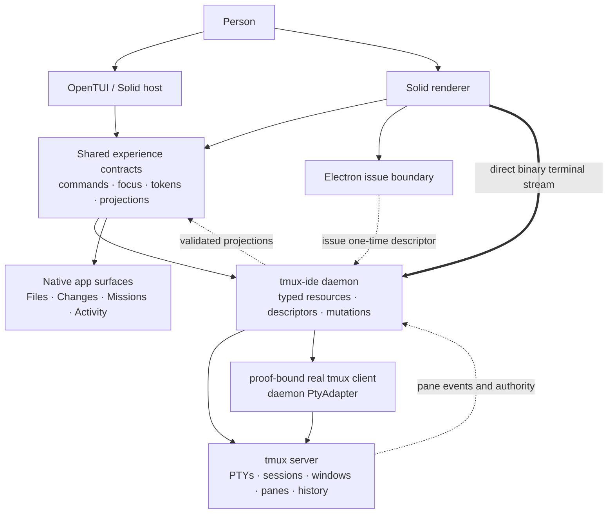
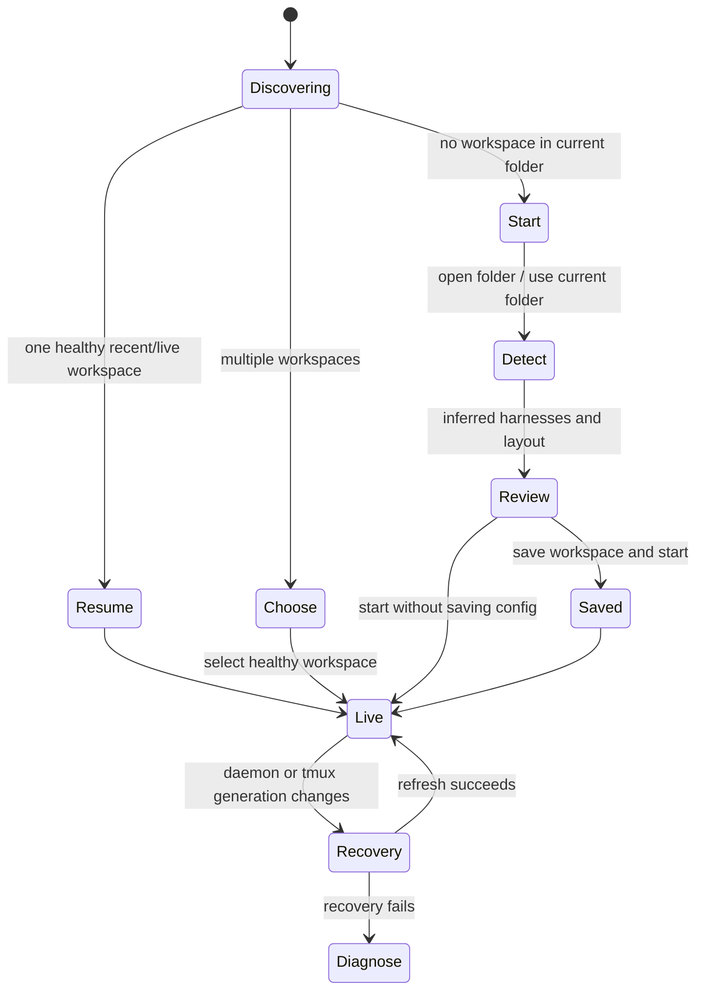

# Native tmux-ide product UX contract

Status: proposed implementation contract<br>
Scope: OpenTUI application and Solid/Electron desktop application<br>
Runtime invariant: tmux is the only terminal, process, topology, and terminal-history authority;
renderers use daemon-issued semantic pane identities

## Outcome

tmux-ide should feel like one terminal-native product with two hosts, not a tmux
layout wrapped in unrelated widgets and not a browser IDE that happens to launch
shells. The terminal application and desktop application share semantic resources,
commands, focus rules, visual roles, and recovery states. Each host translates those
contracts into its native primitives.

The first useful experience must not require authoring YAML. A person can open a
folder, accept an inferred workspace, and reach a live terminal or agent. Saving a
`.tmux-ide/workspace.yml` is an explicit later action. Compatible `ide.yml` files are
read through the existing adapter and can be migrated later without blocking launch.

Files, Changes, Missions, Activity, onboarding, and command discovery are native app
surfaces. They are never synthetic tmux panes. Every terminal surface, including an
agent harness, is a view onto a real tmux pane.

## Clean-room reference boundary

The following projects were inspected for observable interaction patterns and
architecture vocabulary only:

| Reference                     | Transferable pattern                                                                                                                   | Explicitly not transferred                                                       |
| ----------------------------- | -------------------------------------------------------------------------------------------------------------------------------------- | -------------------------------------------------------------------------------- |
| Gloomberb                     | Dense app bar, focused pane chrome, command-first navigation, dock/float/zoom verbs, shared behavior across terminal and desktop hosts | Source, names, assets, glyph sequences, theme values, finance-specific layout    |
| NodeTerm                      | Immediate terminal/agent creation, spatial orientation, helpful empty canvas, one visible creation locus                               | Source/assets; React Flow; storage; renderer-owned or parallel shell/PTY runtime |
| T3 Code                       | Typed renderer/host boundary, honest startup readiness, a reusable web renderer inside a desktop shell                                 | Source, visual design, provider runtime, application state model                 |
| tuiboard / tuiparts / OpenTUI | Responsive zones, behavior-versus-style separation, keyboard/focus primitives, headless snapshots                                      | Board data model, component source, or styling recipes                           |

NodeTerm is BUSL-1.1 and is treated as a behavioral reference only. Gloomberb is also
used only as an observable behavioral reference. This design does not introduce either
application as a dependency and does not reproduce their source, assets, terminal
runtime, or transport. All tmux-ide components and interaction details below are
original and use native tmux-ide contracts. ADR-0002 permits the existing daemon
`PtyAdapter` solely around a fixed real tmux client; it does not permit a reference
runtime or a second shell authority.

“Parity” in this document means product-quality capability parity: coherent chrome,
navigation, onboarding, recovery, and pane manipulation. It does not mean pixel
copying or making tmux-ide impersonate another product.

## Product authority



Hard boundaries:

- A renderer cannot spawn a PTY, invent a semantic pane identity, author a terminal
  command/cwd, or receive a raw tmux `%pane_id`. Raw correlation stays inside the
  daemon only; Electron main holds neither raw tmux proof nor product-state
  correlation.
- A terminal tile obtains a short-lived, single-use, daemon-instance/request/origin-
  bound attachment descriptor through the narrow Electron host issue call, then
  streams bytes directly to the daemon. Electron main never proxies terminal input,
  output, resize, acknowledgements, or lifecycle events.
- The daemon may reuse its existing `PtyAdapter`/`node-pty` boundary only to host a
  fixed argv-safe real `tmux attach-session` into a proof-bound ephemeral one-window
  view. That view creates no shell, agent, pane history, or parallel process authority.
- App layout state may describe how panes are presented, but terminal existence,
  command execution, scrollback, and lifecycle always resolve back to tmux.
- Durable daemon credentials and reusable, directly admissible terminal endpoints
  remain in the trusted host. The renderer may receive only the expiring one-use
  attachment descriptor defined by ADR-0002; it is memory-only, redacted, and inert
  after atomic redemption or expiry.
- A stale or invalid resource fails visibly. Electron never substitutes preview
  fixtures for live state.
- Mission data may be displayed as history or capability state. The app must not
  imply that mission orchestration exists until a current runtime contract ships.

## Workspace anatomy

```text
┌──────────────────────────────── Application bar ────────────────────────────────┐
│ project / workspace     Home  Terminals          Search commands        window │
├───────────────┬─────────────────────────────────────────────────────────────────┤
│ Context       │ Workspace canvas                                                │
│               │ ┌──────── pane chrome ────────┐ ┌──────── pane chrome ───────┐ │
│ Sessions      │ │ title · harness · state  ◻ ⋯ │ │ title · harness · state ◻ ⋯│ │
│ Agents        │ ├──────────────────────────────┤ ├─────────────────────────────┤ │
│ Attention     │ │ live tmux terminal body      │ │ live tmux terminal body     │ │
│               │ └──────────────────────────────┘ └─────────────────────────────┘ │
├───────────────┴─────────────────────────────────────────────────────────────────┤
│ + New │ Files │ Changes │ Missions │ Activity                collapse │ maximize │
├─────────────────────────────────────────────────────────────────────────────────┤
│ connection / recovery       safe-state explanation                next action   │
└─────────────────────────────────────────────────────────────────────────────────┘
```

The hierarchy is deliberate:

1. The application bar changes the product mode or opens a global action.
2. The sidebar locates a running tmux resource and reports attention.
3. Pane chrome manipulates exactly one tmux pane or its app presentation.
4. The bottom dock holds project tools that are useful beside terminals.
5. The status strip explains runtime truth and recovery without stealing focus.

Chrome is quiet when healthy. Attention, recovery, and destructive actions use
strong color only when their semantic state requires it.

## Core interaction contracts

### 1. Zero-config workspace onboarding

The front door is a state machine, not a static welcome page.



Requirements:

- With one unambiguous healthy workspace, “Resume” is the primary action.
- With more than one, show a searchable chooser with project name, path, state,
  running agent count, and last activity. Keyboard selection is available from the
  first frame.
- With none, “Use this folder” and “Open folder…” are the primary choices. Stack and
  available harness detection happen after folder choice.
- Show two or three inferred layouts as visual previews. The recommended layout is
  preselected, but the person can change terminal count, harness, or command before
  launch.
- “Start workspace” launches an in-memory/default workspace. It does not require a
  configuration write.
- “Save workspace” writes `.tmux-ide/workspace.yml` explicitly. The UI explains that
  saving makes the arrangement reproducible, not runnable.
- A compatible `ide.yml` launches immediately through the adapter. Offer
  `migrate --dry-run` / migration as a non-blocking follow-up.
- The first-run product tour is optional, skippable, and rerunnable from the command
  palette. Each choice is saved when made; there is no fragile final “Save all” step.
- The tour teaches only actions the user can immediately perform: open the palette,
  create a terminal, create an agent, focus/zoom a pane, and open the dock.
- The flow is harness-neutral. Codex, Claude Code, and future harnesses are data from
  detection/capability contracts, not hard-coded product modes.

Success measure: a clean install with tmux present reaches an interactive shell in at
most two primary decisions after folder selection.

### 2. Terminal pane and window chrome

Every terminal pane receives the same `PaneFrame` anatomy:

```text
┌ grip │ icon title · optional harness │ status / attention │ zoom │ split │ menu ┐
│                         live tmux terminal body                         │
└─────────────────────────────────────────────────────────────────────────┘
```

Requirements:

- The body is a stable mount point for the real terminal transport. Status, title,
  focus, or attention updates must not remount it or erase scrollback/selection.
- Header and border geometry never change when focus changes. Use color, inset
  treatment, or an overlay for active state so focus cannot cause flicker or a
  one-pixel/cell layout shift.
- Application focus, terminal-input ownership, layout-edit selection, agent
  activity, attention, floating state, and maximized state remain independent.
- Title order is stable: terminal icon, user title, harness/command metadata, state.
  Less important fields disappear before the title at compact widths.
- Essential controls stay right-pinned. At compact width, `zoom` and `menu` survive;
  secondary actions move into the menu.
- `zoom` maps to the semantic tmux zoom command and follows the resulting daemon
  snapshot. It is not a CSS-only illusion.
- `split` requests a daemon-owned tmux split. Direction is chosen contextually or in
  the action menu; the renderer does not execute a shell command.
- Close is a menu action unless the pane is floating. If tmux reports an active
  process, require a focused confirmation with the exact pane title and consequence.
- A header click focuses the pane; a terminal-body click grants terminal input.
  Header actions never leak their click/key into the PTY.
- Mouse drag/resize uses one capture owner and one semantic operation stream. A
  failed mutation restores the last daemon-confirmed geometry.
- The TUI represents the same verbs with cell-safe glyphs; desktop uses original
  semantic icons. Neither host copies reference-project icon assets.

### 3. Bottom workbench dock

The dock is the consistent home for native project tools. It is not another terminal
row.

The strip contains three groups:

- `+ New`: Terminal and Agent creation, using the typed create-pane flow.
- Surface tabs: Files, Changes, Missions, Activity.
- Dock actions: collapse/restore and maximize/restore.

Requirements:

- The tab strip remains visible in collapsed mode and when the terminal canvas is
  maximized.
- Open height and last active tab persist per project. Clamp restored sizes to the
  current viewport rather than rejecting or overflowing them.
- Desktop supports pointer resizing with a visible grip and keyboard resizing from
  the dock action menu. OpenTUI supports cell-based resizing through the same
  semantic commands.
- Selecting the active tab while the dock is open collapses it; selecting a tab while
  collapsed opens it. Maximize is a separate toggle.
- Left/Right/Home/End use roving tab focus and skip disabled tools. Enter/Space
  activate. Pointer and keyboard emit the same command trace.
- Tab content switches immediately. Do not animate keyboard tab changes.
- Inactive tools retain selection, scroll, and draft state where safe. They may stop
  expensive background work only through an explicit surface lifecycle contract.
- The Files, Changes, Missions, and Activity bodies render as native OpenTUI/DOM
  surfaces. No dock tab creates or occupies a tmux pane.
- A disabled or future surface remains discoverable with a concise reason. Missions
  must say when only persisted/history data is available; it must not simulate an
  orchestrator.
- On a narrow host, tabs horizontally scroll/clip while the `+ New` and dock actions
  remain reachable. The current tab and attention state survive abbreviation.

### 4. Command palette

The palette is the product’s command and resource router, not a second set of menu
items.

Requirements:

- DOM and OpenTUI consume one versioned command/resource descriptor registry. Hosts
  may render differently but may not invent independent command lists.
- Results include commands, workspaces, sessions, agents, panes, files, and settings
  only when their capability is available.
- Ranking uses normalized prefix, word-boundary, subsequence, recency, and context
  signals. The same input produces the same ordering in both hosts.
- Results are grouped by semantic category. A heading is never keyboard-selectable.
- Each row can expose label, detail, shortcut, current state, status, and a disabled
  reason. Disabled reasons are presentation metadata and do not pollute search rank.
- Show an initial Suggested/Recent group before typing. Do not present a blank list.
- Up/Down/Home/End navigate enabled rows; Enter runs the primary action; a documented
  secondary key may reveal a resource without running it; Escape closes; focus returns
  to the exact semantic origin.
- Search input owns text while open. Global surface shortcuts and PTY forwarding are
  suspended until the palette closes.
- Loading, no-results, error, and retry are first-class projected rows, not unrelated
  overlay text.
- Searching raw terminal output is an explicit command with explicit scope. The
  default palette never silently indexes sensitive PTY contents.
- Keyboard-opened palettes switch instantly. Pointer-opened desktop palettes may use
  a short opacity/transform entrance; reduced motion makes it instant.

### 5. Empty, error, stale, and recovery states

Every blocking state answers four questions: what happened, what remains safe, what
the user can do now, and where details live.

| State               | Preserve                                                                               | Primary action                            | Never do                                       |
| ------------------- | -------------------------------------------------------------------------------------- | ----------------------------------------- | ---------------------------------------------- |
| Discovering         | Window chrome and recent identity                                                      | Wait/cancel only if genuinely cancellable | Show fake workspace content                    |
| No workspace        | Folder choice and detected system readiness                                            | Use/Open folder                           | Demand YAML                                    |
| Workspace chooser   | Search and keyboard selection                                                          | Open selected                             | Auto-open an ambiguous project                 |
| Starting            | Selected project and progress stage                                                    | Cancel if safe                            | Spawn duplicate sessions on retry              |
| Live                | Full app                                                                               | Contextual                                | Hide degraded resources                        |
| Stale snapshot      | Last validated content, visibly marked                                                 | Refresh                                   | Present stale data as current                  |
| Reconnecting        | Last validated terminal frame, input disabled until a fresh descriptor and tmux redraw | Retry now                                 | Replay a cached tail or create a second writer |
| Daemon unavailable  | Project identity and diagnostics                                                       | Start/reconnect daemon                    | Replace live mode with preview fixtures        |
| Incompatible daemon | Version facts                                                                          | Restart/update the older side             | Retry forever                                  |
| Mutation failed     | Last daemon-confirmed layout/state                                                     | Retry or dismiss                          | Leave optimistic geometry as truth             |
| Terminal exited     | Scrollback and exit status                                                             | Restart/new terminal                      | Discard evidence automatically                 |

Additional rules:

- Reconnection is generation-bound. Events from a retired host/daemon generation
  cannot update the current UI.
- A same-daemon refresh preserves subscriptions and known-safe content. A daemon
  identity change retires the previous connection before the new one becomes
  authoritative.
- Terminal reconnect always issues a fresh one-time descriptor, resets the emulator
  for the real tmux client's fresh redraw, and rejects late bytes from the retired
  request. Control-mode output, `capture-pane`, and replay tails are not terminal
  framebuffer initialization.
- Retry is idempotent and visibly busy. Repeated activation cannot create overlapping
  connections or tmux panes.
- Technical detail is copyable from an expandable diagnostics section. The primary
  message remains plain language.
- Non-blocking warnings live in the status strip or a dismissible notice. They do not
  replace the workspace.
- An application crash or renderer reload never kills tmux sessions.

### 6. Coherent visual language

The existing `VisualTokensV1`, semantic icons, `PaneFrame`, and workbench dock
presenters remain the foundation. Product polish should extend those roles rather
than add component-local colors and arbitrary dimensions.

Token rules:

- Surfaces communicate depth: canvas < terminal/panel < raised control < overlay.
- Borders communicate structure; only one semantic focus role is bright at a time.
- Status colors mean state everywhere: neutral, information/running, warning/needs
  attention, danger/failure, success/completed.
- Text has a stable hierarchy: title, primary, secondary, metadata, muted. A disabled
  label cannot be represented by opacity alone in increased-contrast mode.
- Original semantic icons have one grid and stroke family. TUI glyphs are mapped by
  meaning, never by attempting pixel similarity.
- Application chrome uses the product monospace stack. The terminal font remains a
  user-configurable terminal concern.
- Density has three named host translations: compact, standard, spacious. Components
  consume the semantic density, not independent magic breakpoints.

Motion rules:

- Focus, selection, terminal activity, pane activation, tab changes, and keyboard
  commands are instant.
- Desktop hover/color feedback may transition for at most 150 ms.
- Pointer-opened overlays may enter in at most 150 ms and exit in at most 100 ms using
  opacity/transform only. Never animate layout width/height during terminal resize.
- Progress motion is linear and only shown when progress is real. Indeterminate motion
  has a static reduced-motion equivalent.
- `prefers-reduced-motion` and the app preference both disable nonessential motion.
- OpenTUI animation is reserved for low-frequency state explanation; terminal-cell
  focus and navigation never animate.

### 7. Responsive and keyboard behavior

Hosts translate into the same three density variants:

| Variant  | Desktop baseline                   | OpenTUI baseline      | Behavior                                                                            |
| -------- | ---------------------------------- | --------------------- | ----------------------------------------------------------------------------------- |
| Spacious | at least 1440 px and enough height | at least 160×45 cells | Full sidebar labels, pane metadata, shortcuts, multi-column canvas                  |
| Standard | 1000–1439 px                       | 96×30 to 159×44 cells | Normal sidebar, responsive pane grid, abbreviated metadata                          |
| Compact  | 720–999 px                         | below 96×30 cells     | Icon rail, one focused pane or stacked canvas, clipped tabs, essential actions only |

Width alone is insufficient: short viewports also downgrade density. A resize keeps
the selected workspace, pane, dock tab, scroll positions, and terminal body mounted.

Keyboard ownership:

| Context                       | Contract                                                                                                     |
| ----------------------------- | ------------------------------------------------------------------------------------------------------------ |
| Terminal owns input           | Printable keys, Tab, and terminal control chords including `Ctrl-C` go to tmux. They never quit the app.     |
| Application chrome owns focus | Arrows move within a component; Tab/Shift-Tab move between focus zones; Enter/Space activate.                |
| Overlay open                  | Only the top overlay receives input; Escape closes one layer and restores semantic focus.                    |
| Desktop quit                  | Native `Cmd-Q`/platform quit uses the host shutdown barrier; tmux sessions remain unless explicitly stopped. |
| TUI detach/quit               | `Ctrl-Q` opens or performs the documented detach flow; `Ctrl-C` remains PTY input.                           |
| Global discovery              | `Cmd/Ctrl-K` opens the palette from either host and reports its origin.                                      |

Function-key surface shortcuts remain available in OpenTUI. Desktop may display
platform shortcuts, but both resolve to the same command IDs. Shortcut conflicts are
resolved by active focus layer, not by registering many independent global handlers.

### 8. Optional spatial terminal presentation

A node-like terminal map is a later, optional presentation mode after the grid terminal
surface is complete. It is a tmux-ide feature, not an embedded reference app.

Requirements:

- Every tile is keyed by a daemon-issued semantic pane identity. The daemon alone
  correlates that identity to the current raw tmux `%pane_id`; neither Electron main
  nor the renderer receives or persists the raw correlation. Switching between grid
  and map cannot create, clone, or replace a terminal process.
- Pan/zoom/placement are app presentation state. Create, split, close, restart, rename,
  and focus remain daemon-owned semantic tmux mutations.
- The camera can fit all panes or focus one pane. The current zoom percentage and a
  reset/fit action are visible without covering terminal controls.
- Terminal resizing has exactly one authority. Camera zoom must not generate a resize
  storm; only a stable interactive viewport may request a tmux size change.
- An empty map uses the same `+ New` action and explains terminal/agent creation in one
  sentence. It does not become an unlabelled black canvas.
- The default presentation remains the inferred/reproducible workspace layout until
  spatial mode has persistence, recovery, keyboard, and accessibility proofs.

## Ordered implementation cards

### UX-01 — Real terminal body in the shared PaneFrame

Highest impact. Replace the desktop placeholder pane body with the validated native
tmux attachment stream defined by ADR-0002.

Acceptance:

- At least one live tmux pane renders, accepts input, resizes, reconnects, and preserves
  scrollback across status-only rerenders.
- The renderer cannot access durable daemon/tmux credentials, author command/cwd, or
  spawn a PTY; its one-use descriptor is request/origin/instance/proof-bound.
- Electron main has no terminal input/output/resize/ACK byte path. Renderer and daemon
  use the bounded direct binary WebSocket after descriptor issue.
- The daemon `PtyAdapter` launches only fixed argv-safe real `tmux attach-session` in a
  proof-bound ephemeral one-window view; tmux owns process, history, and redraw truth.
- Issue records requested viewer mode; daemon `ready` reports effective mode,
  authoritative shared-window grid, and client viewport. Read-only rejects input and
  resize authority; mismatched viewports clip/scroll instead of changing shared tmux
  geometry.
- Mode-specific admission reserves the sole writer only for effective interactive;
  read-only reserves reader authority plus proven continuous interactive geometry
  ownership or fails typed. Issue also reserves pending-ticket capacity; redeem alone
  swaps that pending slot for one live-connection slot and activates—never
  re-reserves—the mode authority. Atomic issue/redeem, expiry, daemon generation,
  Origin/CSP, pre-auth socket capacity, bounded redemption, implementable PTY
  completion/drain or fail-closed flow control, fresh-redraw reconnect, and detach
  behavior have adversarial and live tmux tests.
- `Ctrl-C` reaches the foreground process; app shutdown remains separate.
- Desktop tests prove the terminal mount sentinel is not replaced when chrome/status
  changes.

### UX-02 — Pane chrome completion and focus stability

Acceptance:

- Populate zoom, split, action-menu, and state/attention descriptors from live daemon
  capabilities.
- Focus changes produce no geometry delta, terminal resize, remount, or visible border
  flicker.
- Pointer and keyboard action traces are identical.
- Pane snapshots cover idle, terminal focus, attention, recovery, layout selection,
  floating, and maximized states at compact/standard/spacious widths.

### UX-03 — Zero-config front door and rerunnable tour

Acceptance:

- Automated flows cover 0, 1, and many discovered workspaces; legacy config; invalid
  config; missing tmux; unavailable harness; and daemon recovery.
- Starting without saving config works. Saving uses `.tmux-ide/workspace.yml`.
- The inferred review shows two or three layout previews and never emits legacy
  `team`, pane `role`/`task`, `sidebar`, or `orchestrator` fields.
- The tour is skippable, resumable, rerunnable, reduced-motion safe, and keyboard
  complete.

### UX-04 — Useful native bottom dock

Acceptance:

- Wire `+ New` to the typed Terminal/Agent flow.
- Replace summary placeholders with the real native Files and Changes surfaces first;
  Activity and truthful Missions/history follow their current resource availability.
- Persist selected tab, mode, and preferred height per project.
- Prove collapse/open/maximize, drag/keyboard resize, focus, scroll retention, disabled
  reasons, and narrow overflow in both hosts.

### UX-05 — Command palette registry and ranking v2

Acceptance:

- One descriptor registry drives DOM and OpenTUI.
- Deterministic ranking and grouping tests cover commands and live resources.
- Suggested, loading, no-match, error, retry, disabled-reason, primary action,
  secondary action, focus restoration, and nested overlay cases are tested.
- Palette actions execute semantic commands only; renderer shell strings are rejected.

### UX-06 — Unified recovery and empty-state language

Acceptance:

- Implement the state table above as typed projections with one canonical copy deck.
- No Electron live path imports or displays fixtures.
- Reconnect preserves the last safe frame, blocks duplicate input writers, and rejects
  retired-generation events.
- Every blocking state passes keyboard, screen-reader, copyable-diagnostics, and retry
  idempotence tests.

### UX-07 — Cohesion pass for tokens, icons, density, and motion

Acceptance:

- Audit app/PaneFrame/dock/palette/create flow for raw color, spacing, radius, focus,
  and motion values; replace unjustified values with shared roles.
- Establish one original icon grid and semantic icon coverage for every visible action.
- No focus transition changes layout; no keyboard-triggered action animates.
- Dark, light, increased contrast, reduced motion, inactive window, and compact density
  snapshots pass for both hosts.

### UX-08 — Responsive and keyboard conformance

Acceptance:

- Shared fixtures generate the compact/standard/spacious state for both hosts.
- Resize tests keep semantic selection and terminal mount identity stable.
- Focus-zone traversal, overlay stack, roving tabs, PTY passthrough, shortcut conflicts,
  and exact focus return have interaction traces.
- Required OpenTUI snapshots exist at 80×24, 120×40, and 200×60; desktop component and
  application tests cover 720×480, 1280×820, and 1600×1000.

### UX-09 — Optional spatial terminal map

Acceptance:

- Ship behind an explicit view selector after UX-01 through UX-08 are complete.
- Grid/map switching retains daemon-issued semantic pane identity and live terminal
  processes without exposing raw tmux correlation to Solid.
- Camera, placement, fit/focus, empty guidance, persistence, recovery, and one resize
  authority have dedicated tests.
- Dependency audit confirms no NodeTerm/Gloomberb source, assets, transport, or runtime
  entered the product; `node-pty` remains isolated behind the daemon `PtyAdapter` and
  can launch only the real tmux client, never a parallel shell/runtime.

## Quality gate

A card is not complete because its component renders. It must provide:

1. A pure projection/model test for every meaningful state.
2. Host interaction traces proving pointer and keyboard converge on the same semantic
   command.
3. Stable visual snapshots at the required desktop and terminal sizes.
4. Focus, reduced-motion, increased-contrast, and disabled-reason coverage.
5. A tmux-authority test proving the renderer cannot synthesize pane/process truth.
6. Recovery tests for stale generation, retry, teardown, and reattachment where the
   surface consumes live resources.
7. No copy of reference-project source, styling values, icons, or assets.

## Highest-impact immediate changes

1. Put the real tmux stream in the existing stable desktop `PaneFrame` body. Until that
   happens, visual polish reads as a prototype because the central surface is still a
   status placeholder.
2. Give live pane frames real zoom/split/menu descriptors and make active focus a
   geometry-neutral treatment. This directly addresses missing chrome and flicker.
3. Move Terminal/Agent creation into a visible `+ New` entry on the bottom dock and let
   the workspace start without writing configuration.
4. Replace dock summaries with Files and Changes, then make the palette search one
   shared registry of commands and live resources.
5. Consolidate the recovery copy/state table before adding more surfaces, so every new
   surface inherits honest stale/error behavior instead of inventing it.
