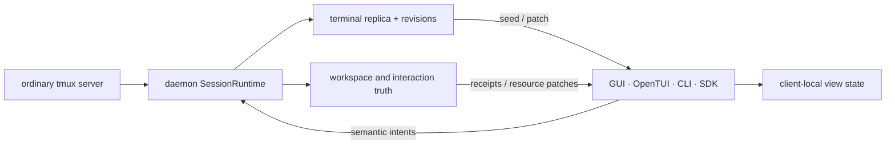

# ADR: one session runtime, many thin clients

Status: current daemon authority; client consolidation remains in progress
(updated for M59 on 2026-08-14)

## Decision

Exactly one daemon `SessionRuntime` owns observation and mutation for a tmux
server/session pair. GUI, OpenTUI, CLI, SDK, and test drivers speak semantic
contracts. They never create a tmux control client, resolve `%N`/`@N`/`$N`, or
run tmux commands.

The daemon owns shared truth: semantic identity joins, terminal generations and
revisions, layout, mutations and their ordered receipts, leases, and recovery.
A client owns presentation truth: focus, selection, scroll/search state, open
dialogs, dock/tab presentation, and its render baseline. Local state may be
persisted per view but is never published as shared tmux state.

## Contracts

- Terminal replicas begin with a generation-bound seed. Every patch names its
  exact base revision; a gap requires a new seed.
- Mutations are semantic intents and receive an accepted, observed, rejected,
  or timed-out receipt on the existing interaction spine. Runtime tmux
  addresses never cross the contract; there is no second receipt vocabulary.
- `.tmux-ide/workspace.yml` remains optional. Discovery of ordinary live tmux
  sessions is daemon truth and requires no project configuration.

## Forbidden dependencies

Client layers must not import `@tmux-ide/tmux-bridge`, control-mode parsers or
clients, `MirrorService`, `SessionChannel`, or daemon tmux adapters. The
architecture test freezes the two actual OpenTUI direct-control constructions
to an exact m56.4 deletion target. A separate assertion freezes direct
`tmux-bridge` command/polling imports for deletion in m56.6; helper debt is not
mislabelled as control ownership. Both migrations retain the current OpenTUI
framebuffer and input lifecycle.

## Current implementation status

The daemon-owned `SessionRuntime`, bounded seed/patch delivery, semantic intent
contracts, authority leases, and generation fencing are implemented. OpenTUI
and Web consume parts of that runtime, but their product composition is not yet
one small shared client: the OpenTUI root remains 9,029 lines and contains four
direct tmux command sites. M59 therefore treats m56 as component-landed, not
product-qualified.

The next migration boundary is deletion: compose one renderer-neutral client,
cut OpenTUI over first, remove its superseded lifecycle paths, then cut Web over
to the same client. There is no second runtime and no compatibility authority.

## Non-goals

This ADR does not replace the retained OpenTUI renderer, add another TUI
runtime, introduce a canvas SDK, require a workspace file, or prescribe a Rust
rewrite. Infinite-canvas experiments and closed-source canvas dependencies are
outside the architecture.
