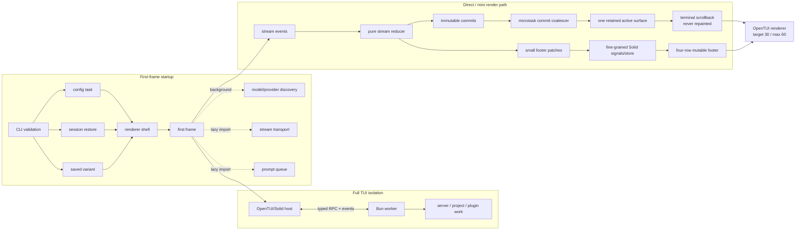
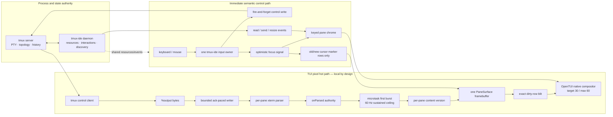

# OpenTUI performance system

Status: implementation contract 
Scope: tmux-ide OpenTUI host, shared terminal/core boundaries, and daemon handshakes 
Reference: OpenCode v2 (`context/opencode`) observed at the 2026-08-10 checkout

## Outcome

The tmux-ide TUI must feel like a native tmux client: input is never queued behind
discovery or app surfaces, terminal output changes only the rows whose cells changed,
and control-state feedback appears without waiting for a terminal frame. The desktop
GUI and TUI still consume the same daemon resource and interaction contracts; this
document only specializes how the OpenTUI host turns those projections into pixels.

OpenCode has two useful performance systems. Its full TUI isolates backend work in a
worker and communicates through RPC. Its direct/mini UI keeps an append-only transcript
outside the reactive tree and repaints only a small interactive footer. tmux-ide cannot
copy the append-only transcript model because a tmux pane is a live, random-access VT
screen, often in the alternate buffer. It can—and does—apply the same boundary:
terminal cell buffers are mutable native surfaces, while focus, status, communication,
and controls are small semantic chrome projections.

No OpenCode implementation code is copied. The local checkout is a clean-room
architecture and behavior reference; tmux-ide retains its own tmux authority,
protocols, renderables, and tests.

## OpenCode v2 system graph

The important hot-path properties are:

- expensive server/project work is outside the renderer event loop;
- independent startup reads run concurrently and optional systems load after the
  first frame;
- stable transcript output leaves the Solid tree permanently;
- streamed commits coalesce once per microtask and retain only the unstable tail;
- reactive collections use stable keys and keyed reconciliation;
- the renderer targets 30 fps for continuous work but can burst to 60 fps for
  explicit input and updates;
- one input/keymap owner prevents focus systems from racing each other;
- `renderer.idle()` is an explicit lifecycle barrier, not a timing guess.

Primary observed implementation seams:

- `context/opencode/packages/opencode/src/cli/cmd/tui.ts` — worker/RPC boundary;
- `context/opencode/packages/opencode/src/cli/cmd/run/runtime.ts` and
  `runtime.boot.ts` — concurrent boot and background discovery;
- `context/opencode/packages/opencode/src/cli/cmd/run/runtime.lifecycle.ts` —
  renderer cadence, split-footer lifecycle, and lazy footer import;
- `context/opencode/packages/opencode/src/cli/cmd/run/footer.ts` — microtask commit
  queue and fine-grained footer state;
- `context/opencode/packages/opencode/src/cli/cmd/run/scrollback.surface.ts` —
  retained unstable stream surface versus immutable scrollback.

## tmux-ide native-speed graph

The control and pixel paths intentionally converge only at the compositor. A
`send-keys`, pane read, or local focus action can illuminate pane chrome immediately;
it does not wait for terminal output and it never marks every pane cell dirty. When
the PTY output subsequently arrives, the parser and framebuffer independently paint
the exact changed terminal rows.

## Reference-to-product mapping

| OpenCode technique                   | tmux-ide application                                                                                               | Decision                             |
| ------------------------------------ | ------------------------------------------------------------------------------------------------------------------ | ------------------------------------ |
| Backend worker/RPC                   | Existing daemon owns discovery and shared resources; TUI keeps only latency-sensitive control-mode mirroring local | Applied architectural equivalent     |
| Immutable transcript scrollback      | Per-pane xterm buffer plus exact dirty-row framebuffer shadow                                                      | Adapted for random-access VT screens |
| One retained unstable stream surface | One persistent `PaneSurfaceRenderable` per visible pane                                                            | Applied                              |
| Microtask commit batching            | First dirty burst publishes in a microtask; sustained output is frame-capped                                       | Applied                              |
| Tiny reactive footer                 | Terminal pixels stay outside Solid JSX; status/focus/communication remain keyed chrome                             | Applied                              |
| 30 target / 60 maximum fps           | Same OpenTUI cadence; explicit renders can still burst to 60                                                       | Applied                              |
| Single focus/keymap owner            | OpenTUI `autoFocus` disabled; tmux-ide semantic focus is authoritative                                             | Applied                              |
| Lazy optional systems                | TUI dispatcher and compiled binary already lazy-load surfaces; palette discovery is non-blocking                   | Retained and enforced                |
| Split-footer terminal mode           | Not compatible with a full-screen multi-pane tmux mirror                                                           | Rejected intentionally               |
| Move terminal parser to worker       | Would add serialization/IPC to every cell update and input echo                                                    | Rejected; pixels stay local          |

## Frame invalidation contract

Only these causes may request terminal cell work:

| Cause                            | Allowed terminal work                                          |
| -------------------------------- | -------------------------------------------------------------- |
| Parsed PTY output                | Compare and blit dirty rows for that pane                      |
| Scroll offset change             | Full visible-pane repaint because every source row remaps      |
| Surface resize or palette change | One full visible-pane repaint                                  |
| Selection/search change          | Old and new highlighted rows only                              |
| Focus change                     | Old and new cursor-marker rows only; chrome separately         |
| Agent read/send activity         | Chrome/separator overlay only; zero terminal-body invalidation |
| Sidebar, dock, or fleet update   | Affected keyed chrome/app surface only                         |

Output enqueue is not paint authority. The xterm write completion is: scheduling on
both enqueue and parse creates an old-grid frame followed by the real frame. Likewise,
focus is not a terminal-content mutation and must never force a full framebuffer walk.

## Performance budgets and gates

The performance qualification gate (`pnpm test:performance-qualification`) drives the
canonical SessionRuntime, real terminal parser/delivery paths, and demand-driven
OpenTUI/web telemetry adapters. It covers flood output, alternate-screen redraw,
slow and hidden clients, NACK reseeding, socket churn, and authority rollover.

| Metric                                | p95 budget |
| ------------------------------------- | ---------: |
| Local leading input to consumed paint |   16.67 ms |

Additional invariants:

- idle terminal panes produce zero grid walks;
- a focus-only change cannot issue a full pane blit;
- one parsed output burst produces one publication request, not enqueue plus parse;
- communication chrome never remounts or repaints a terminal body;
- input, resize, and focus commands never wait for fleet/discovery subprocesses;
- portable CI publishes deterministic convergence, queue, mutation, and stage-coverage
  evidence; wall-clock latency is evaluated only on the pinned reference host;
- all live performance runs use isolated test-drive sessions and leave user sessions
  untouched.

## Next measured frontier

The remaining large first-frame cost is compiled-module loading and evaluation, not
cell painting. Keep optional dock, mission, file, and discovery code behind the lazy
surface dispatcher, record `module-loaded`, `renderer-created`, `first-frame`,
`solid-mounted`, and `tmux-geometry-ready`, and only split another startup module when
those marks prove it is on the critical path. Do not add a worker between the control
client and pane framebuffer: the worker boundary is valuable for business/discovery
work, but harmful to the terminal pixel loop.
