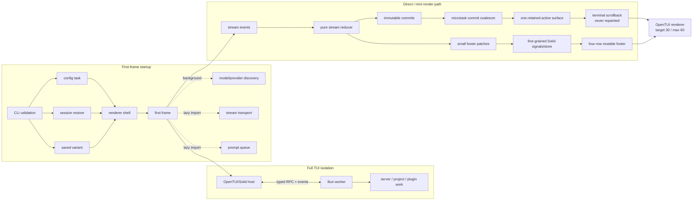
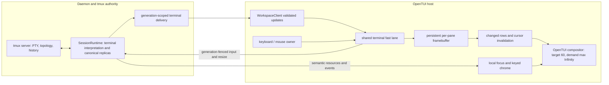

# OpenTUI performance system

Status: current architecture and qualification contract, reviewed 2026-09-16<br>
Scope: tmux-ide OpenTUI host, shared terminal/core boundaries, and daemon handshakes<br>
Historical reference: OpenCode v2 (`context/opencode`) observed at the 2026-08-10 checkout

## Outcome

The tmux-ide TUI must feel like a native tmux client: input is never queued behind
discovery or app surfaces, terminal output changes only the rows whose cells changed,
and control-state feedback appears without waiting for a terminal frame. The desktop
GUI and TUI still consume the same daemon resource and interaction contracts; this
document only specializes how the OpenTUI host turns those projections into pixels.

OpenCode has two useful performance systems. Its full TUI isolates backend work in a
worker and communicates through RPC. Its direct/mini UI keeps an append-only transcript
outside the reactive tree and repaints only a small interactive footer. tmux-ide cannot
copy the append-only transcript model because a tmux pane is a live, random-access VT
screen, often in the alternate buffer. It can—and does—apply the same boundary:
terminal cell buffers are mutable native surfaces, while focus, status, communication,
and controls are small semantic chrome projections.

No OpenCode implementation code is copied. The local checkout is a clean-room
architecture and behavior reference; tmux-ide retains its own tmux authority,
protocols, renderables, and tests.

## OpenCode v2 system graph



The important hot-path properties are:

- expensive server/project work is outside the renderer event loop;
- independent startup reads run concurrently and optional systems load after the
  first frame;
- stable transcript output leaves the Solid tree permanently;
- streamed commits coalesce once per microtask and retain only the unstable tail;
- reactive collections use stable keys and keyed reconciliation;
- the renderer targets 30 fps for continuous work but can burst to 60 fps for
  explicit input and updates;
- one input/keymap owner prevents focus systems from racing each other;
- `renderer.idle()` is an explicit lifecycle barrier, not a timing guess.

Primary observed implementation seams:

- `context/opencode/packages/opencode/src/cli/cmd/tui.ts` — worker/RPC boundary;
- `context/opencode/packages/opencode/src/cli/cmd/run/runtime.ts` and
  `runtime.boot.ts` — concurrent boot and background discovery;
- `context/opencode/packages/opencode/src/cli/cmd/run/runtime.lifecycle.ts` —
  renderer cadence, split-footer lifecycle, and lazy footer import;
- `context/opencode/packages/opencode/src/cli/cmd/run/footer.ts` — microtask commit
  queue and fine-grained footer state;
- `context/opencode/packages/opencode/src/cli/cmd/run/scrollback.surface.ts` —
  retained unstable stream surface versus immutable scrollback.

## Current tmux-ide terminal path

The daemon owns terminal interpretation and canonical replicas. The TUI consumes
validated updates through `WorkspaceClient` and the shared terminal fast lane; it
does not open a second control-mode parser as its own terminal authority.



Terminal content updates and semantic chrome invalidate their own projections.
A local focus change can update chrome without waiting for terminal output; input
and resize still pass through the active daemon authority. A replica gap or wrong
generation triggers repair rather than giving the TUI a second source of truth.

The current renderer targets 60 fps and sets `maxFps` to Infinity. That removes the
maximum-FPS delay for requested frames; it does not request continuous frames.
Invalidation coalescing, idle behavior and output backpressure remain essential.
The 30/60 cadence above describes the historical OpenCode reference only.

Current source boundaries:

- [daemon terminal replica owner](../../packages/daemon/src/terminal/session-runtime/terminal-replica-owner.ts);
- [shared client terminal fast lane](../../packages/daemon-client/src/terminal-fast-lane.ts);
- [OpenTUI fast-lane adapter](../../packages/daemon/src/tui/mirror/runtime/workspace-terminal-fast-lane.ts);
- [renderer cadence](../../packages/daemon/src/tui/mirror/runtime/renderer-cadence.ts);
- [pane framebuffer](../../packages/daemon/src/tui/mirror/pane-surface.tsx).

## Reference-to-product mapping

| OpenCode technique                   | Current tmux-ide application                                                                          |
| ------------------------------------ | ----------------------------------------------------------------------------------------------------- |
| Backend worker/RPC                   | Daemon owns discovery, terminal interpretation and shared resources; host consumes canonical replicas |
| Immutable transcript scrollback      | Retained terminal state and visible framebuffer support random-access and alternate-screen VT content |
| One retained unstable stream surface | Persistent pane surfaces, with addressed-pane invalidation                                            |
| Microtask commit batching            | Coalesce invalidations and obey output backpressure; no fixed 60 Hz publication claim                 |
| Tiny reactive footer                 | Terminal pixels stay outside Solid JSX; status and focus remain semantic chrome                       |
| 30 target / 60 maximum fps           | Reference only; current product cadence is 60 / Infinity on demand                                    |
| Single focus/keymap owner            | OpenTUI auto-focus is disabled; tmux-ide owns semantic focus                                          |
| Lazy optional systems                | Optional surfaces and discovery stay outside the initial terminal path                                |
| Split-footer terminal mode           | Does not fit a full-screen multi-pane terminal workbench                                              |

## Frame invalidation contract

Only these causes may request terminal cell work:

| Cause                             | Allowed terminal work                                          |
| --------------------------------- | -------------------------------------------------------------- |
| Accepted canonical replica update | Compare and blit dirty rows for that pane                      |
| Scroll offset change              | Full visible-pane repaint because every source row remaps      |
| Surface resize or palette change  | One full visible-pane repaint                                  |
| Selection/search change           | Old and new highlighted rows only                              |
| Focus change                      | Old and new cursor-marker rows only; chrome separately         |
| Agent read/send activity          | Chrome/separator overlay only; zero terminal-body invalidation |
| Sidebar, dock, or fleet update    | Affected keyed chrome/app surface only                         |

Raw output enqueue is not paint authority. The daemon publishes interpreted terminal
state; the host paints accepted canonical updates. Scheduling speculative content
work before that state arrives risks an old-grid frame followed by the real frame.
Focus is not a terminal-content mutation and must never force a full framebuffer walk.

## Performance budgets and gates

The performance qualification gate (`pnpm test:performance-qualification`) drives the
canonical SessionRuntime, real terminal parser/delivery paths, and demand-driven
OpenTUI/web telemetry adapters. Its JSON artifact maps every claimed scenario to the
exact suites and files that ran. Flood output, alternate-screen redraw, resize and
drag floods, slow and hidden clients, NACK reseeding, socket churn, authority rollover,
interaction attribution, and terminal colors have deterministic portable coverage.

| Metric                                | p95 budget |
| ------------------------------------- | ---------: |
| Local leading input to consumed paint |   16.67 ms |

Additional invariants:

- idle terminal panes produce zero grid walks;
- a focus-only change cannot issue a full pane blit;
- one accepted terminal update must not acquire duplicate enqueue and parse invalidations;
- communication chrome never remounts or repaints a terminal body;
- input, resize, and focus commands never wait for fleet/discovery subprocesses;
- portable CI publishes deterministic convergence, queue, mutation, and renderer-adapter
  evidence, with uncovered scenarios called out explicitly;
- portable CI does not claim production stage timings, cold/warm startup latency, process
  memory slope, or wall-clock input-to-paint latency;
- all live performance runs use isolated test-drive sessions and leave user sessions
  untouched.

The checked-in [reference budgets](../../performance/reference-budgets.json), including
the 16.67 ms value, are targets, not observed results. A
reference result is generated outside portable CI with
`pnpm measure:performance-reference`. The runner requires a clean macOS/arm64
checkout, builds the production TUI, records process-cold and warm-repeat lifecycle
marks, and drives the real canonical SessionRuntime under eight-client flood in an
explicit-GC child. The generated artifact is ignored by Git and contains the host,
CPU, OS, Node/Bun/tmux versions, source commit and tree, timestamp, raw samples,
percentiles, budgets, and pass/fail decisions.

“Process cold” deliberately means the first new process after one production build;
the runner does not claim to purge macOS file caches. Memory plateau uses the
Theil–Sen median pairwise slope after warmup and two explicit full-GC passes, plus
absolute RSS/heap growth and canonical queue/cache ceilings. This avoids treating a
single allocator or OS RSS spike as a leak while still rejecting sustained growth.

Local input-to-consumed-paint evidence is accepted only from an explicit production
JSONL trace (`--input-trace <path>`). The artifact must carry a header bound to the
same Git commit/tree, and each input/paint pair must share one OpenTUI
`performance.now()` clock and trace ID. The runner never substitutes daemon clocks,
suite durations, or invented samples. Without that trace, the result is honestly
`incomplete`; `pnpm test:performance-reference` requires all three measurements to
pass.

Reference collection intentionally owns the single diagnostics sink, so the F12 HUD
must remain closed during a reference run. Pending input probes use a 256-entry FIFO
and five-second lazy expiry (no timer); a failed send cancels immediately. Missing
terminal output can therefore never turn qualification instrumentation into a leak.

To publish a measured result alongside the portable matrix without weakening CI:

```bash
TMUX_IDE_REFERENCE_REPORT=artifacts/performance-reference.json \
  pnpm test:performance-qualification
```

The portable runner ingests a report only when explicitly requested and rejects a
dirty, stale-commit, stale-tree, malformed, or failed artifact. Per-process input →
tmux → parse → reduce → transport → paint spans remain separate clock-domain
measurements; only the local input/paint endpoints form the end-to-end latency.

## Next measured frontier

The dominant startup and interaction costs must be established on the exact current
artifact. Older module-loading measurements do not prove that module evaluation is
still the largest first-frame cost. Record CLI selection, daemon readiness,
`module-loaded`, `renderer-created`, `first-frame`, `solid-mounted`, and
`first-terminal-frame` separately before changing module boundaries.

Qualification should cover ordinary application wheel input and local history,
quiet and sustained output, alternate-screen apps, resize, and independent clients.
Long active/idle runs with 1/4/8 clients must establish settled queue counts and
retained-generation behavior. Report combined daemon/TUI RSS consistently; summed
RSS is not unique physical memory. The roughly 500 MiB accepted stable footprint is
context, while the 1 GiB TUI reference ceiling is a safety gate, not a new target.

Every published measurement must identify its source commit/tree, CLI/TUI/native
artifact hashes, platform, toolchain, renderer mode, tracing flags, scenario, sample
count and raw evidence. Separate shipping builds from experimental renderers and
record instrumentation overhead. Parser completion and consumed-paint timings are
not physical-display smoothness measurements. Portable test passes and suite
runtimes cannot substitute for these live measurements.
