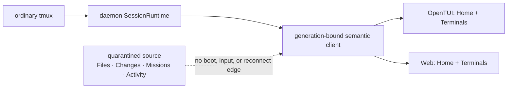

# M59 product baseline

Status: **not product-qualified** (observed 2026-08-14 from parent revision
`d212607d`). The
machine-readable source is [`product-baseline.json`](./product-baseline.json)
and is emitted by `pnpm product:testdrive inventory --json`.

This baseline replaces migration-card completion language with running-product
truth. A component can be landed while the product remains unqualified. Unit
counts alone are never completion evidence, and `passed-with-limitations` is
not a release result.

## Frozen product



Home and Terminals are the only default OpenTUI product surfaces. Files,
Changes, Missions, and Activity remain source-level experiments, but are not
admitted to default navigation, cold feature loading, terminal input, resource
demand, or reconnect restoration. The existing Solid terminal canvas remains
the rendering implementation; no external or closed-source canvas dependency
is introduced.

## Current evidence

The isolated portable run owns an ephemeral state home and a non-default tmux
socket. On 2026-08-14 it measured:

| Boundary                        | Result                     |
| ------------------------------- | -------------------------- |
| process-cold first usable frame | 761 ms — passed            |
| warm first usable frame p95     | 605 ms — passed            |
| resize acknowledgment p95 / max | 220.05 / 222.2 ms — passed |
| coherent terminal frame         | not measured               |
| input to consumed paint         | not measured               |
| drag responsiveness             | not measured               |
| whole portable report           | passed with limitations    |

The source baseline is equally explicit: the OpenTUI root is 9,029 lines; the
Web application shell is 2,217 lines; its tiled workspace is 2,326 lines; and
the OpenTUI root has four remaining direct-tmux command sites. These are M59
deletion targets, not accepted architecture.

## Deterministic defect journeys

Every current defect and qualification gap is listed in
`product-baseline.json` with one reproduction command. The important rule is
that an unmeasured boundary stays red:

```bash
pnpm product:testdrive inventory --json
pnpm measure:performance-portable
wc -l packages/daemon/src/tui/mirror/runtime/application-root.tsx
```

`product:testdrive inventory` and `measure:performance-portable` are safe for
baseline work: they do not read, mutate, resize, or kill the user's default tmux
server, catalog, or state directory. `tui:diagnose` is intentionally excluded
from unattended baseline measurement because it targets an explicitly named
canonical live session; use it only when that target is in scope.

## Completion rule

A card is not Done while any required hard metric is unmeasured, while its
evidence says `passed-with-limitations`, or while a known P0/P1 remains open.
Product completion requires a deterministic packed-product journey, not a unit
test count.
